# Jarkom_Modul3_Lapres_E5

---
5111840000088	Angelita Titiandes Br. Silalahi  
5111840000150   Alberto Sanjaya  
---

## Soal dan Jawaban  
### 1. Membuat topologi jaringan  
Jawaban:  
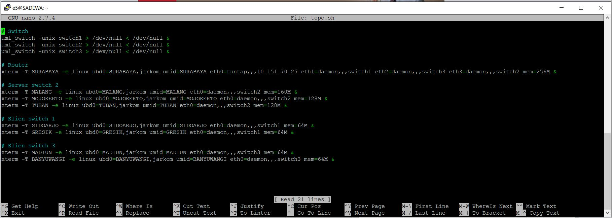  
### 2. SURABAYA ditunjuk sebagai perantara (DHCP Relay) antara DHCP Server dan client.  
Jawaban:  
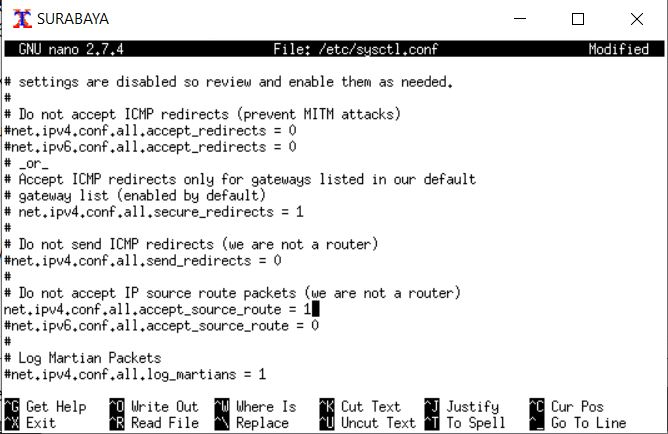  
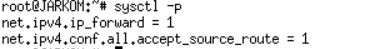  
  
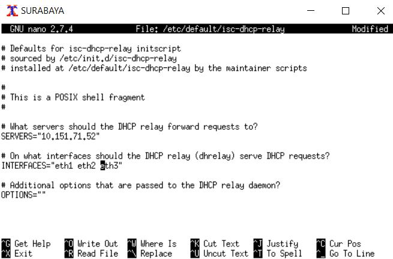  
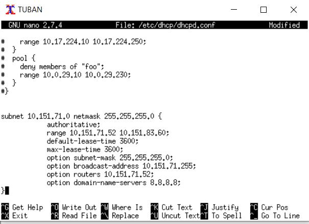  
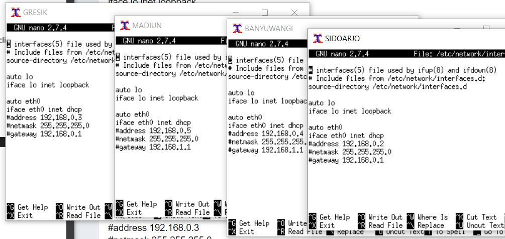  
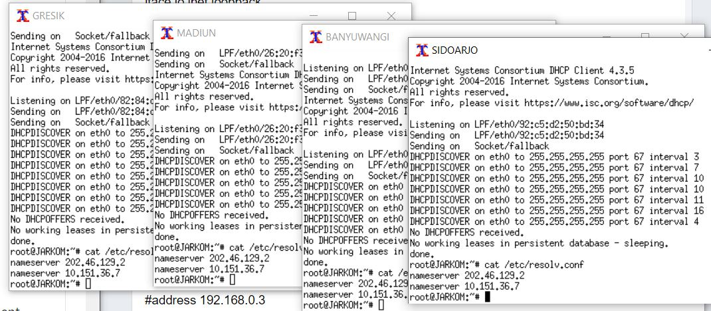  
### 3. Client pada subnet 1 mendapatkan range IP dari 192.168.0.10 sampai 192.168.0.100 dan 192.168.0.110 sampai 192.168.0.200.   
### 4. Client pada subnet 3 mendapatkan range IP dari 192.168.1.50 sampai 192.168.1.70.  
### 5. Client mendapatkan DNS Malang dan DNS 202.46.129.2 dari DHCP  
### 6. Client di subnet 1 mendapatkan peminjaman alamat IP selama 5 menit, sedangkan (6) client pada subnet 3 mendapatkan peminjaman IP selama 10 menit.  
Jawaban:  
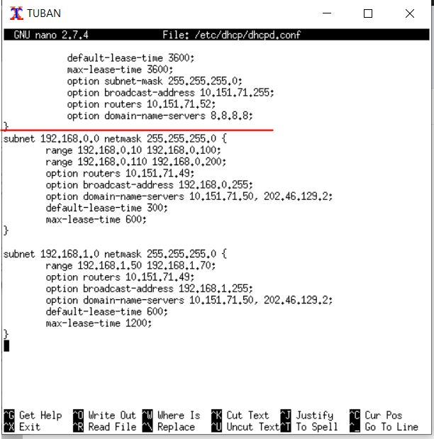  
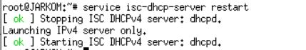  
### 7. User autentikasi milik Anri memiliki format:  
### User : userta_yyy  
### Password : inipassw0rdta_yyy  
Jawaban:  
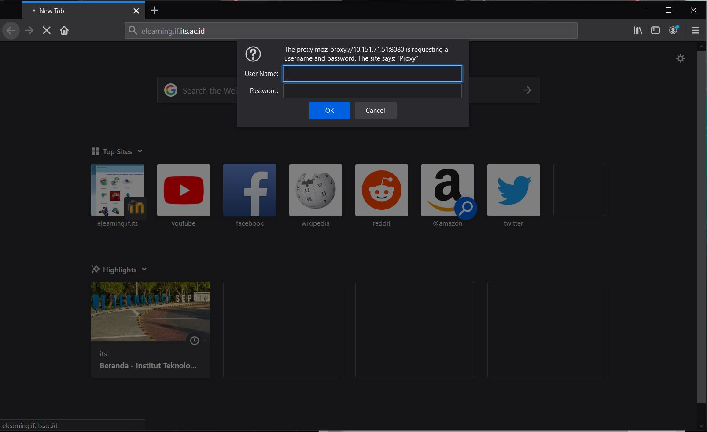  
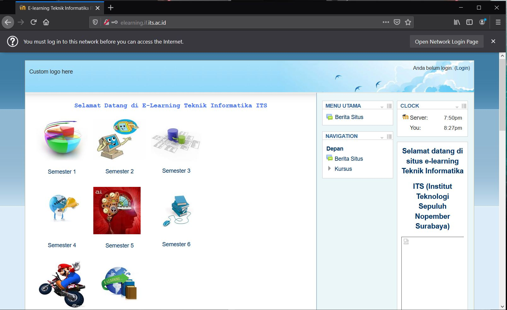  
### 8. Waktu akses setiap hari Selasa-Rabu pukul 13.00-18.00.  
### 9. Waktu akses setiap hari Selasa-Kamis pukul 21.00 - 09.00 keesokan harinya  
Jawaban:  
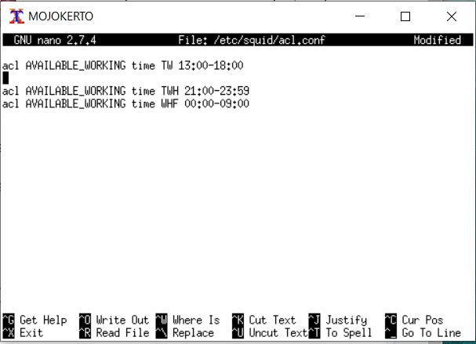  
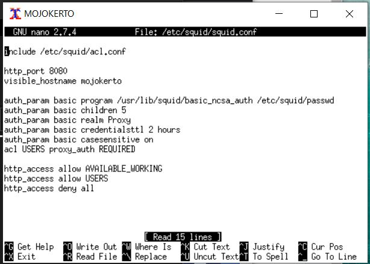  
### 10. Mengatur agar setiap dia mengakses google.com, maka akan di redirect menuju monta.if.its.ac.id  
Jawaban:  
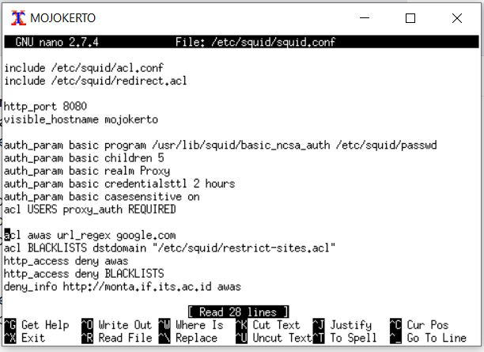  
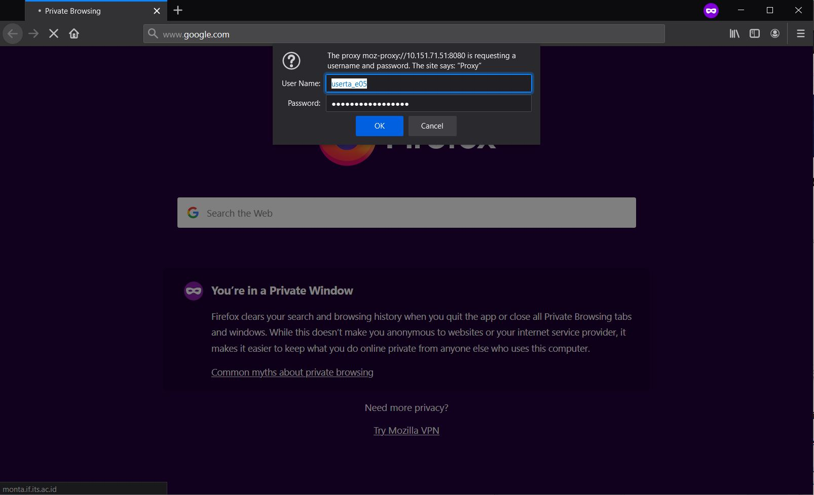  
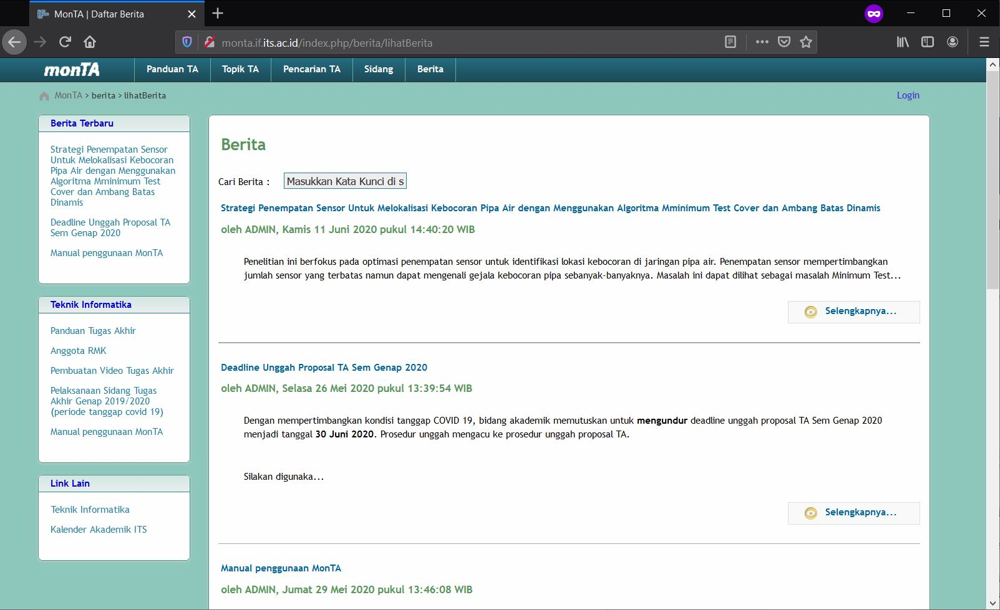  
### 11. Mengubah error page default squid
Jawaban:  
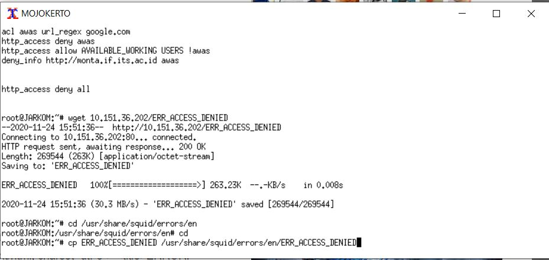  
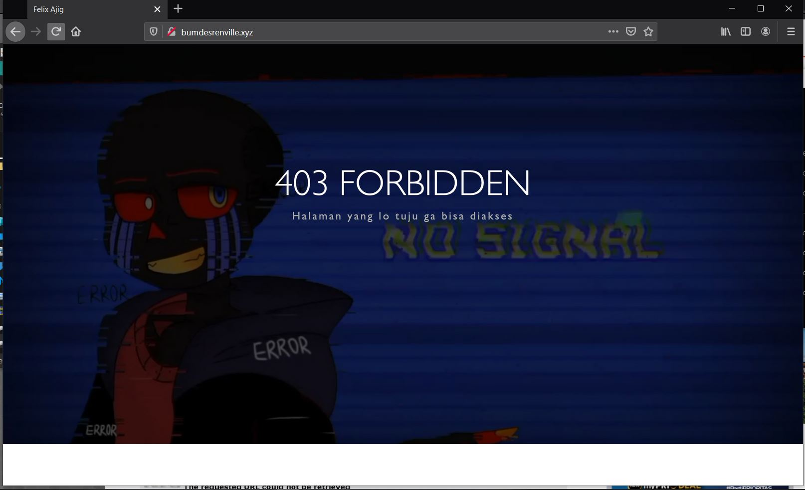  
### 12. membuat proxy dengan domain janganlupa-ta.yyy.pw dan memasukkan port 8080
Jawaban:  
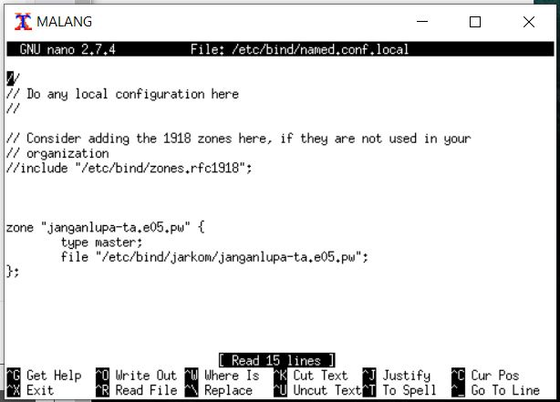  
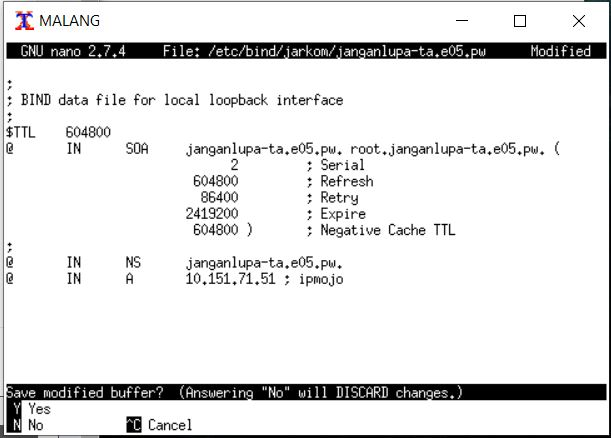  
  
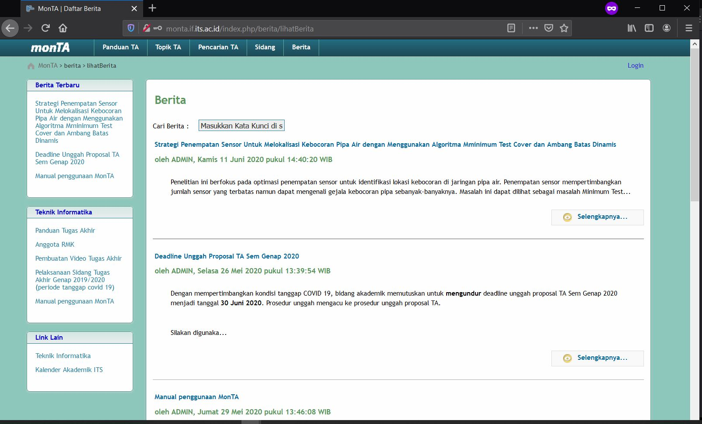  