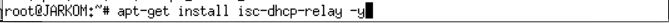
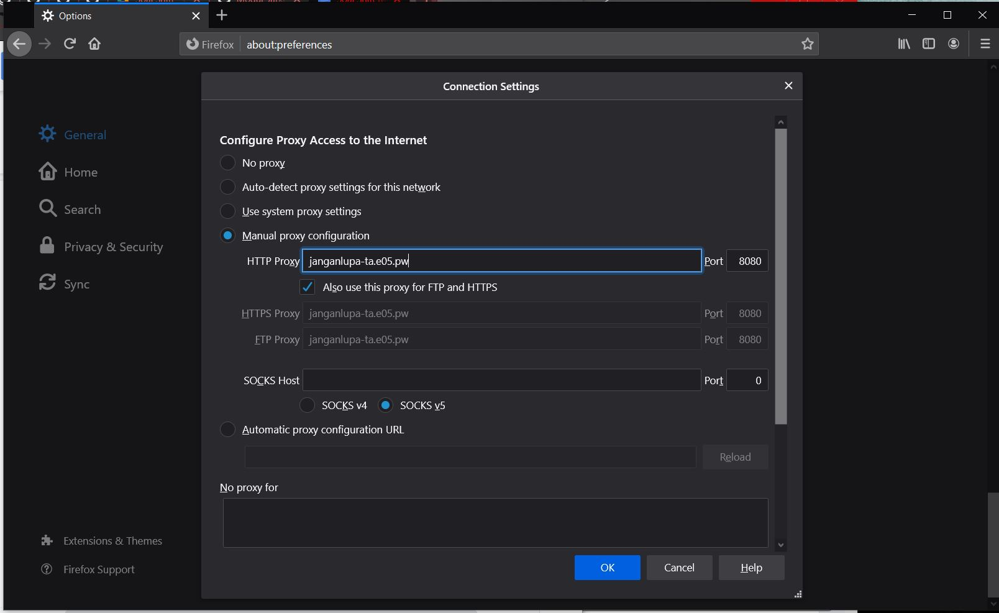

# Jarkom_Modul3_Lapres_E5

---
5111840000088	Angelita Titiandes Br. Silalahi  
5111840000150   Alberto Sanjaya  
---

## Soal dan Jawaban  
### 1. Membuat topologi jaringan  
Jawaban:  
dengan default memory 64 untuk UML selain :  
- SURABAYA : 256M  
- MALANG : 160M  
- MOJOKERTO : 128M  
- TUBAN : 128M  
Maka dihasilkan topo.sh sebagai berikut  
  
### 2. SURABAYA ditunjuk sebagai perantara (DHCP Relay) antara DHCP Server dan client.  
Jawaban:  
pertama-tama melakukan ``` nano /etc/sysctl.conf ``` dan melakukan uncomment dan mengubahnya  
``` net.ipv4.conf.all.accept_source_route ```  
menjadi  
``` net.ipv4.conf.all.accept_source_route = 1 ```  
  
Kemudian menjalankan ``` sysctl -p ``` pada UML  
  
Selanjutnya menginstal DHCP relay dengan cara ``` apt-get install isc-dhcp-relay -y ```  
  
Setelah menekan ``` OK ``` pada saat instalasi, buka file configurasinya dengan ``` nano /etc/default/isc-dhcp-relay ```  
dan mengubahnya seperti pada gambar berikut  
  
Setelah itu lakukan configurasi dhcp pada UML TUBAN  
  
Berikutnya mengubah isi file ``` /etc/network/interfaces ``` pada UML Client  
Kemudian update
  
Lakukan ``` cat /etc/resolv.conf ``` untuk mengecek
  
### 3. Client pada subnet 1 mendapatkan range IP dari 192.168.0.10 sampai 192.168.0.100 dan 192.168.0.110 sampai 192.168.0.200.   
### 4. Client pada subnet 3 mendapatkan range IP dari 192.168.1.50 sampai 192.168.1.70.  
### 5. Client mendapatkan DNS Malang dan DNS 202.46.129.2 dari DHCP  
### 6. Client di subnet 1 mendapatkan peminjaman alamat IP selama 5 menit, sedangkan (6) client pada subnet 3 mendapatkan peminjaman IP selama 10 menit.  
Jawaban:  
  
  
### 7. User autentikasi milik Anri memiliki format:  
### User : userta_yyy  
### Password : inipassw0rdta_yyy  
Jawaban:  
Melakukan ``` htpasswd -c /etc/squid/passwd userta_e05 ``` pada UML Mojokerto untuk membuat user
Kemudian inputkan password ``` inipassw0rdta_e05 ```  Masukkan kembali password untuk konfirmasi  
Maka ketika dicoba di browser akan tampil seperti berikut:  
  
Dan ketika di inputkan password dan username sesuai yang dibuat maka akan memberikan akses ke website yang dituju seperti pada gambar berikut :  
  
### 8. Waktu akses setiap hari Selasa-Rabu pukul 13.00-18.00.  
### 9. Waktu akses setiap hari Selasa-Kamis pukul 21.00 - 09.00 keesokan harinya  
Jawaban:  
Buat file ```/etc/squid/acl.conf``` pada UML Mojokerto yang berisi sebagai berikut :
  
Kemudian modifikasi ``` /etc/squid/squid.conf ``` pada UML Mojokerto seperti pada gambar berikut :
  
Setelah itu lakukan ``` service squid restart ``` maka user hanya bisa mengakses pada jam dan hari yang ditentukan
#### Revisi no 8 dan 9  
Memperbaiki konfigurasi pada ```/etc/squid/acl.conf``` menjadi seperti berikut :  
  
juga pada ``` /etc/squid/squid.conf ``` pada bagian ``` http_access ``` seperti berikut  
  
### 10. Mengatur agar setiap dia mengakses google.com, maka akan di redirect menuju monta.if.its.ac.id  
Jawaban:  
Memodifikasi ``` /etc/squid/squid.conf ``` pada UML Mojokerto seperti pada gambar berikut :
  
dimana terdapat penambahan berupa :  
- ``` acl awas url_regex google.com ``` untuk mencatat domain bersangkutan yang di "simpan" dengan nama "awas"  
- ``` http_access deny awas ``` dimana agar user tidak dapat mengakses "awas"  
- ``` deny_info http://monta.if.its.ac.id awas ``` dimana berfungsi untuk mengarahkan user ketika membuka domain yang di deny, akan diarahkan ke domain yang sudah di setting  
Berikut contoh ketika mencoba mengakses www.google.com  
  
  
### 11. Mengubah error page default squid
Jawaban:  
Pada tahap ini setelah mendownload melalui ``` wget 10.151.36.202/ERR_ACCESS_DENIED ```  
Dilakukan pengubahan pada dengan men-copy file yang baru tersebut ke ``` /usr/share/squid/errors/en/ERR_ACCESS_DENIED``` agar file pada folder tersebut tereplace dengan file error yang baru didownload.  
  
Berikut tampilan hasil mengubah tampilan error page  
  
### 12. membuat proxy dengan domain janganlupa-ta.yyy.pw dan memasukkan port 8080
Jawaban:  
Melakukan konfigurasi pada UML Malang pada file ``` /etc/bind/named.conf.local ``` setelah melakukan instalasi bind9 untuk membuat zone  
  
Melakukan konfigurasi dari zone yang sudah dibuat dimana IP diarahkan ke MOJOKERTO  
  
Mengubah setting PROXY dengan nama zone yang sudah dibuat  
  
Sehingga dapat menghasilkan sebagai berikut  
  